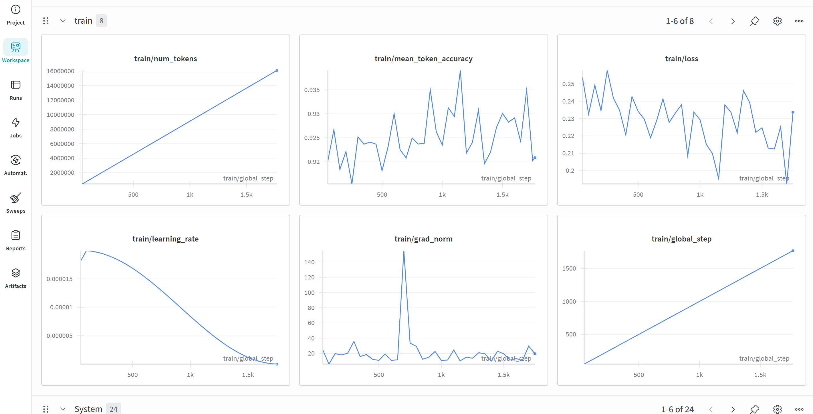

# Fine-tuning Projects

This folder contains fine-tuning experiments for Vision-Language Models (VLM) and Language Models (LLM).

---

## 1. ChartQA - Vision Language Model Fine-tuning

**Path:** `vlm_fine_tuning/chartqa/Qwen/Qwen2.5-VL-3B-Instruct/`

### Overview
Fine-tuning Qwen2.5-VL-3B-Instruct for chart question answering task.

### Dataset
- **Source:** HuggingFaceM4/ChartQA
- **Train:** 28,299 samples
- **Validation:** 1,920 samples
- **Test:** 2,500 samples

### Training Methods

#### Full Fine-tuning
| Parameter | Value |
|-----------|-------|
| Epochs | 1 |
| Batch Size | 4 |
| Gradient Accumulation | 4 |
| Learning Rate | 2e-5 |
| Scheduler | Cosine |
| Precision | bf16 |

#### LoRA Fine-tuning
| Parameter | Value |
|-----------|-------|
| Epochs | 2 |
| Batch Size | 8 |
| Gradient Accumulation | 4 |
| Learning Rate | 1e-4 |
| LoRA Rank (r) | 32 |
| LoRA Alpha | 64 |
| Target Modules | q_proj, k_proj, v_proj, o_proj, up_proj, down_proj, gate_proj |

### Evaluation
- **Metric:** Relaxed Accuracy (allows ±5% tolerance for numerical answers)
- **Test Samples:** 1,000

### Results

| Model | Accuracy |
|-------|----------|
| Base | 71.70% |
| Full FT | 74.60% (+2.90%p) |
| LoRA | TBD |

### Full Fine-tuning Analysis

#### wandb

#### Training Metrics

**Loss & Accuracy**
- Initial loss: 0.25 → Final loss: 0.23
- Token accuracy stabilized at ~92%

**Gradient Norm**
- Spike observed at step ~700 (peaked at 150), likely due to noisy data batch
- Recovered and stabilized at ~25 after step 800

**Learning Rate**
- Cosine decay schedule with warmup
- Peak at ~2e-5, gradually decayed to near zero

#### Validation Metrics (during training)

- Eval loss: 0.32 → 0.275 (continuously improved)
- Eval token accuracy: 0.901 → 0.912
- No overfitting observed (both train and eval metrics improved together)

#### Notes

- Total steps: 1,769 (1 epoch)
- The gradient spike at step 700 suggests some data samples may need cleaning for future training runs

---

## 2. Multi-Document Summarization (MDS)

**Path:** `mds/Multi-News/Qwen/Qwen2.5-7B-Instruct/`

### Overview
LoRA fine-tuning for Korean text summarization task.

### Model
- **Base Model:** kakaocorp/kanana-1.5-2.1b-instruct-2505

### Dataset
- **Train:** 3,300 samples
- **Evaluation:** 880 samples

### Training Configuration

| Parameter | Value |
|-----------|-------|
| Epochs | 3 |
| Batch Size | 2 |
| Gradient Accumulation | 2 |
| Learning Rate | 1e-4 |
| Max Sequence Length | 2,048 |
| LoRA Rank (r) | 8 |
| LoRA Alpha | 32 |
| Target Modules | q_proj, v_proj |
| Scheduler | Constant |
| Precision | bf16 |

### Model Deployment
Fine-tuned LoRA adapter uploaded to Hugging Face Hub: `congrats-hg/kanana-summarizer-2-1850`

---

## Environment
- **Hardware:** RTX 5090 Server
- **Framework:** PyTorch (CUDA 12.8), Transformers, TRL, PEFT
- **Conda Environment:** fine-tuning
